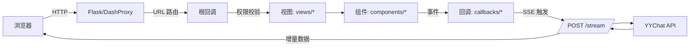

yyAsistant 文档总览（中文）

本目录收录本项目的中文文档与示意图。建议从下列入口阅读：

- 《Feffery 系列库梳理与能力概览》：feffery_libraries.md
- 《架构总览》：architecture_overview.md
- 《请求生命周期与数据流》：request_lifecycle.md
- 《组件与模式清单》：component_usage.md
- 《chat 页面开发计划（功能清单/进度跟踪）》：chat_dev_plan.md

示意图预览

- 登录页示意（静态资源）：
  
  

- 架构简图（Mermaid）：
  

