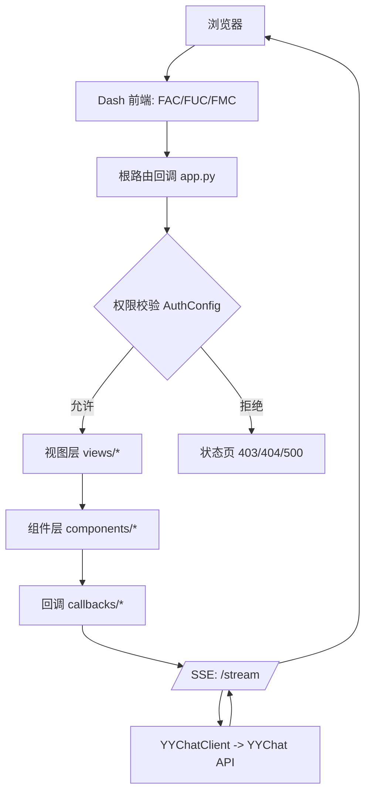

yyAsistant 架构总览

核心技术栈

- Dash 3 + dash-extensions (DashProxy, SSE/streaming)
- Feffery 系列：FAC/FUC/FMC/FDU
- Flask（登录/权限、SSE 端点、请求前检查）
- Peewee + SQLite（用户、日志等模型）

分层与关键模块

- 入口：`server.py` 创建 `DashProxy` 与 Flask 集成，配置登录/权限、SSE `/stream`
- 应用装配：`app.py` 版本校验、注册回调、根路由、全局 UI（TopProgress/Reload/Download）
- 配置：`configs/` 包含基础参数、路由菜单、权限规则、布局
- 视图：`views/` 页面渲染函数（首页、登录、日志、用户管理、独立页面等）
- 组件：`components/` 封装可复用 UI（侧边栏、聊天输入、消息气泡等）
- 回调：`callbacks/` 注册交互逻辑（聊天输入、SSE 触发与完成同步）
- 模型：`models/` Peewee ORM 模型（`Users` 等）
- 工具：`utils/yychat_client.py` 封装后端聊天 API 调用（支持流式）

页面与路由

- 根路由回调在 `app.py`：监听 `FefferyLocation` 的 pathname
  - 公共页面直出（/login、403/404/500 demo）
  - 未登录跳转 `/login`
  - 已登录：按 `AuthConfig.pathname_access_rules` 校验访问权限
  - 渲染核心页面 `views/core_pages` 内容（可选 `AntdWatermark` 水印）
- 侧边菜单由 `RouterConfig.core_side_menu` 定义，`components/core_side_menu.py` 根据权限动态裁剪

聊天功能流

- 前端输入：`components/chat_input_area.py`（FAC+FUC 布局）
- 回调：`callbacks/core_pages_c/chat_input_area_c.py`
  - 用户输入后立即将占位 AI 消息入列（is_streaming=True）
  - 触发 SSE：构造请求数据并通过 `dash_extensions.streaming.sse_options` 连接 `/stream`
  - 客户端回调处理 `animation`，增量拼接 Markdown 文本并更新 DOM
  - SSE 完成后派发自定义事件，触发后端回调将最终内容同步到 `Store`
- 服务端 `/stream`：`server.py`
  - 调用 `yychat_client.chat_completion(stream=True)` 迭代发送 JSON 块（包含 message_id，用于定位目标 DOM）

权限与用户

- `Flask-Login` + `Flask-Principal`：加载用户、注入角色、定义 `Permission`
- `AuthConfig`：角色集合、页面访问规则（include/exclude/all）
- `Users` 模型：密码校验、CRUD、会话 token 管理

全局体验

- `FefferyTopProgress` 控制回调运行时的顶部进度动画
- `FefferyReload`、`dcc.Download`、全局重定向 `Fragment` 协同全局交互
- 浏览器版本与类型在 `@app.server.before_request` 统一校验

架构示意图（Mermaid）

示意图（静态资源示例）

- 登录页动效插画：

  
