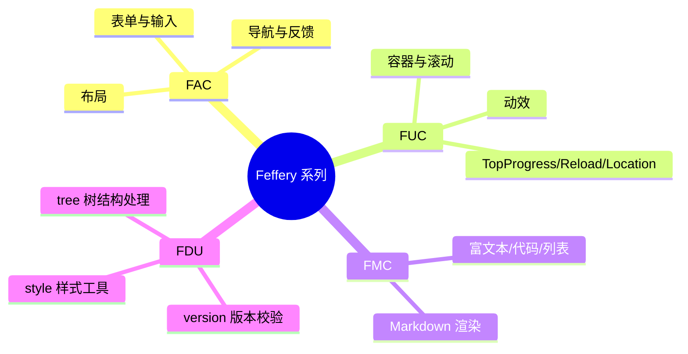

Feffery 系列库梳理与能力概览

本项目大量使用 Feffery 系列 Dash 组件库来构建前端界面与交互。以下总结基于当前虚拟环境中安装的库以及项目内使用情况。

已安装的 Feffery 相关库

- feffery_antd_components (FAC) 0.4.x
  - Ant Design 风格的 Dash 组件封装：菜单、面包屑、表单、输入、按钮、布局、头像、文本等
  - 项目广泛用于：`AntdMenu`、`AntdRow/Col`、`AntdForm`、`AntdInput`、`AntdButton`、`AntdBreadcrumb`、`AntdAlert`、`AntdAvatar`、`AntdText` 等
- feffery_utils_components (FUC) 0.3.x
  - 常用 UI/交互增强组件：`FefferyDiv`(带样式/滚动/阴影)、`FefferyLocation`、动效 `FefferyMotion`、`FefferyTopProgress`、`FefferyReload` 等
  - 项目用于：布局容器、滚动条、全局进度条、全局刷新、URL 监听
- feffery_markdown_components (FMC) 0.4.x
  - Markdown 渲染组件 `FefferyMarkdown`
  - 项目用于：流式 AI 回复区的 Markdown 渲染
- feffery_dash_utils (FDU) ≥0.2.6
  - 实用工具：`style_utils.style` 统一样式生成；`version_utils` 进行运行时依赖与 Python 版本校验；`tree_utils.TreeManager` 处理树/菜单结构
  - 项目用于：集中管理行内样式、启动时版本校验、权限过滤侧栏菜单

与 Dash 生态的配合

- 搭配 `dash_extensions` 的 `DashProxy`、`SSE`/`streaming` 模块，实现前端 SSE 流式推送
- 结合 `dash_iconify` 提供丰富图标
- 保持 FAC/FUC/FMC 的属性命名与 Dash 标准一致，易于回调联动

使用建议

- 样式统一使用 `feffery_dash_utils.style_utils.style` 生成，避免硬编码 CSS 与风格不一致
- 容器优先选用 `fuc.FefferyDiv`，获得阴影、滚动条等统一行为
- 文本内容（尤其 AI 回复）优先使用 `fmc.FefferyMarkdown` 渲染，便于链接/代码/列表等富文本展示
- 菜单/树结构处理使用 `TreeManager` 做增删改，保持菜单与权限逻辑清晰
- 全局交互（进度、重载、跳转）优先使用 FUC 组件（TopProgress/Reload/Location）

版本与兼容

- app 启动前通过 `check_python_version` 与 `check_dependencies_version` 强约束依赖版本，确保 FAC/FUC/FMC/FDU API 行为一致
- 升级时需同步检查：FAC 0.5.x/1.x 可能存在属性变更；FDU 的工具函数命名可能有小幅变动

可视化概览（Mermaid）

