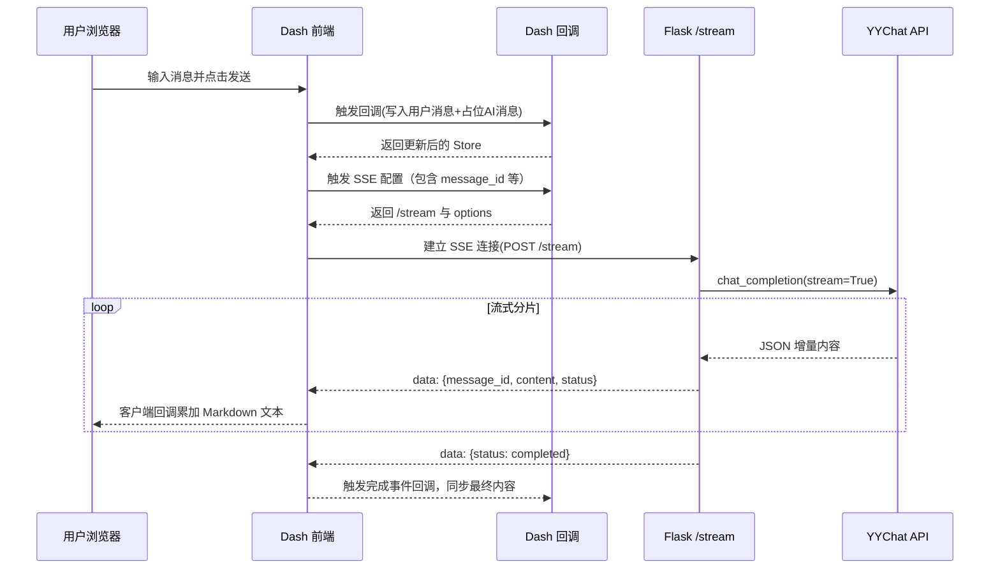

请求生命周期与数据流

页面加载

- 浏览器请求 -> Flask `before_request` 校验浏览器版本/类型
- Dash 加载：`app.layout` 渲染全局容器与 `FefferyLocation`、顶部进度等
- 根路由：监听 `root-url.pathname`，按公共/鉴权/权限策略返回页面内容

交互与回调

- FAC/FUC/FMC 组件触发 Dash 回调，`on_error` + `running` 控制错误与进度动画
- 侧边菜单点击 -> `FefferyLocation` 更新 -> 根回调切页

聊天流（SSE）

- 输入提交 -> 回调将用户消息与占位 AI 消息写入 `Store`
- 变化触发 SSE 回调：构造 payload（历史对话、会话ID、人格ID、message_id）
- 前端建立 SSE 连接 `/stream`，服务端持续推送 `{message_id, content, status}`
- 客户端回调累加 `content` 并更新对应 `FefferyMarkdown`，完成时派发事件
- 服务端回调接收完成事件，写回 `Store` 的最终内容，置 `is_streaming=False`

后端服务交互

- `yychat_client` 统一封装 API 基址、鉴权头
- 流式响应通过 `requests.iter_lines()` 逐条解包

错误与重试

- SSE 内部异常：以 `{status:error, error:...}` 形式推送；前端不打断状态同步
- 根回调异常：统一渲染 500 页面

SSE 聊天时序图（Mermaid）

