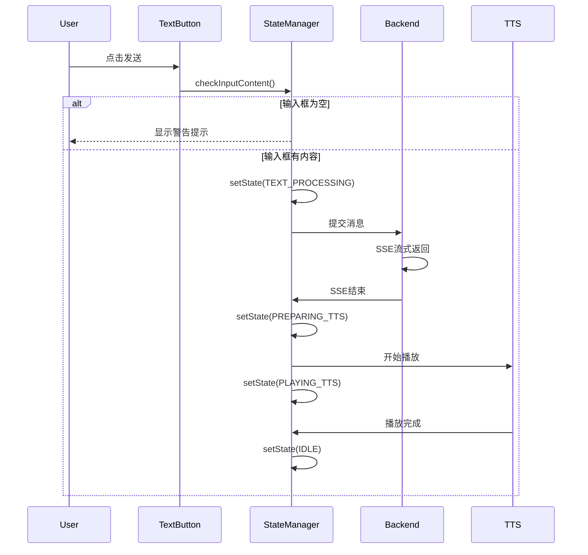
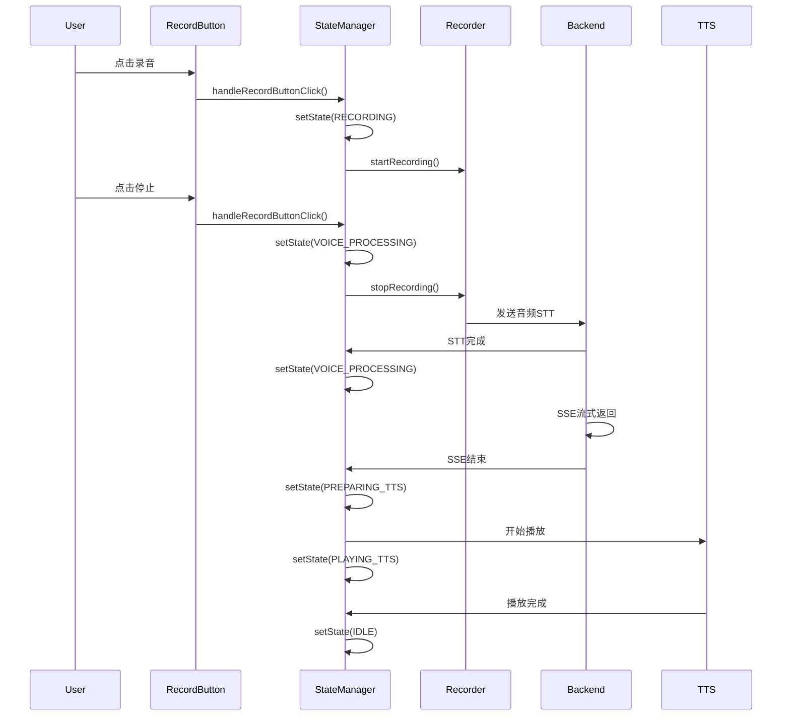

# 统一按钮状态管理方案

## 文档概述

**文档目的**: 实现文本按钮、录音按钮、通话按钮的统一状态管理
**创建日期**: 2025-10-15
**状态**: 开发中

## 背景

当前系统中文本按钮、录音按钮、通话按钮的状态管理分散在不同的模块中，导致状态不一致和交互混乱。需要实现统一的按钮状态管理器，协调三个按钮在不同场景下的状态变化。

## 核心场景

### 场景一：文本聊天

**状态流转**:
```
S0: [文本:可用] [录音:可用] [通话:可用] - 起始状态
    ↓ 点击文本按钮
    ├─ 输入框为空 → 保持S0状态，显示警告提示
    └─ 输入框有内容 ↓
S1: [文本:busy] [录音:灰色] [通话:灰色] - 开始处理
S2: [文本:busy] [录音:灰色] [通话:灰色] - SSE流式返回中
S3: [文本:busy] [录音:黄色处理] [通话:灰色] - SSE结束，准备TTS
S4: [文本:busy] [录音:绿色播放] [通话:灰色] - TTS播放中
S5a: [文本:可用] [录音:可用] [通话:可用] - 播放结束自动回到初始状态
S5b: [文本:可用] [录音:可用] [通话:可用] - 点击绿色录音按钮停止播放
```

**关键点**:
- S0→S1: 必须验证输入框有内容才能进入S1
- S3→S4: SSE结束后自动触发TTS播放
- S4→S5: 支持手动停止播放或自动完成

### 场景二：录音对话

**状态流转**:
```
S0: [文本:可用] [录音:可用] [通话:可用] - 起始状态
S1: [文本:灰色] [录音:红色录音] [通话:灰色] - 开始录音
S2: [文本:灰色] [录音:红色录音] [通话:灰色] - 录音中
S3: [文本:灰色] [录音:黄色处理] [通话:灰色] - 停止录音，STT处理
S4: [文本:busy] [录音:黄色处理] [通话:灰色] - STT完成，进入SSE
S5: [文本:busy] [录音:黄色处理] [通话:灰色] - SSE流式返回中
S6: [文本:busy] [录音:黄色处理] [通话:灰色] - SSE结束，准备TTS
S7: [文本:busy] [录音:绿色播放] [通话:灰色] - TTS播放中
S8a: [文本:可用] [录音:可用] [通话:可用] - 播放结束自动回到初始状态
S8b: [文本:可用] [录音:可用] [通话:可用] - 点击绿色录音按钮停止播放
```

**关键点**:
- S1→S2: 录音中可以点击停止
- S3: 录音停止后立即进入STT处理
- S4: STT完成后，文本按钮变busy，录音按钮保持黄色
- S6→S7: SSE结束后自动触发TTS播放

### 场景三：语音实时对话（未来实现）

**状态流转**:
```
S0: [文本:可用] [录音:可用] [通话:可用] - 起始状态
S1: [文本:灰色] [录音:灰色] [通话:红色通话] - 开始实时通话
S2: [文本:灰色] [录音:灰色] [通话:红色通话] - 通话中
S3: [文本:可用] [录音:可用] [通话:可用] - 通话结束
```

## 按钮状态定义

### 文本按钮（ai-chat-x-send-btn）
| 状态 | 描述 | 颜色 | 图标 | 可点击 | Dash属性 |
|------|------|------|------|--------|----------|
| 可用 | 正常状态 | 蓝色 | 发送 | ✅ | `disabled=False, loading=False` |
| busy | 处理中 | 蓝色 | 转圈 | ❌ | `disabled=True, loading=True` |
| 灰色 | 不可用 | 灰色 | 发送 | ❌ | `disabled=True, loading=False` |

### 录音按钮（voice-record-button）
| 状态 | 描述 | 颜色 | 图标 | 可点击 | 背景色 |
|------|------|------|------|--------|--------|
| 可用 | 正常状态 | 白色 | 🎤 | ✅ | `#1890ff` |
| 红色录音 | 录音中 | 白色 | ⏹️ | ✅ | `#ff4d4f` |
| 黄色处理 | 处理中 | 白色 | ⏳ | ❌ | `#faad14` |
| 绿色播放 | 播放中 | 白色 | ⏸️ | ✅ | `#52c41a` |
| 灰色 | 不可用 | 白色 | 🎤 | ❌ | `#d9d9d9` |

### 通话按钮（voice-call-btn）
| 状态 | 描述 | 颜色 | 图标 | 可点击 | 背景色 |
|------|------|------|------|--------|--------|
| 可用 | 正常状态 | 白色 | 📞 | ✅ | `#52c41a` |
| 红色通话 | 通话中 | 白色 | ⏹️ | ✅ | `#ff4d4f` |
| 灰色 | 不可用 | 白色 | 📞 | ❌ | `#d9d9d9` |

## 技术架构

### 1. 统一按钮状态管理器

**文件**: `assets/js/unified_button_state_manager.js`

**职责**:
- 管理全局按钮状态
- 协调三个按钮的状态变化
- 处理按钮点击事件
- 提供状态切换API

**核心类**: `UnifiedButtonStateManager`

**全局状态定义**:
```javascript
GLOBAL_STATES = {
    IDLE: 'idle',                     // 所有按钮可用
    TEXT_PROCESSING: 'text_processing', // 文本处理中（SSE）
    RECORDING: 'recording',            // 录音中
    VOICE_PROCESSING: 'voice_processing', // 语音处理中（STT）
    PREPARING_TTS: 'preparing_tts',   // 准备TTS（SSE结束）
    PLAYING_TTS: 'playing_tts',       // TTS播放中
    CALLING: 'calling'                 // 实时通话中
}
```

**核心方法**:
- `setState(newState)`: 切换全局状态
- `checkInputContent()`: 检查输入框内容
- `handleTextButtonClick()`: 处理文本按钮点击
- `handleRecordButtonClick()`: 处理录音按钮点击
- `handleCallButtonClick()`: 处理通话按钮点击
- `startTextProcessing()`: 开始文本处理
- `startRecording()`: 开始录音
- `stopRecording()`: 停止录音
- `prepareForTTS()`: 准备TTS
- `startPlayingTTS()`: 开始播放TTS
- `stopPlayingOrComplete()`: 停止播放或完成
- `resetToIdle()`: 重置到空闲状态

### 2. 集成点

#### 2.1 前端集成

**文件**: `app.py`
- 在 `index_string` 中引入统一状态管理器脚本
- 脚本加载顺序：统一状态管理器 → 其他语音相关脚本

**文件**: `voice_recorder_enhanced.js`
- 录音开始时调用状态管理器
- 录音停止时调用状态管理器
- STT完成时通知状态管理器

**文件**: `voice_player_enhanced.js`
- 播放开始时调用状态管理器
- 播放结束时调用状态管理器
- 播放错误时重置状态

#### 2.2 后端集成

**文件**: `callbacks/core_pages_c/chat_input_area_c.py`
- 文本提交前验证输入框内容
- SSE开始时维持busy状态
- SSE结束时通知前端准备TTS

**客户端回调**:
- 文本按钮点击验证
- 输入框内容检查
- 状态管理器调用

## 状态切换时序图

### 场景一：文本聊天


### 场景二：录音对话


## 错误处理

### 1. 输入验证失败
- **场景**: 用户点击文本按钮但输入框为空
- **处理**: 显示警告提示，保持当前状态
- **恢复**: 无需恢复，用户输入内容后重试

### 2. STT失败
- **场景**: 录音上传或转录失败
- **处理**: 显示错误提示，调用 `resetToIdle()`
- **恢复**: 自动重置到空闲状态

### 3. SSE连接失败
- **场景**: SSE连接中断或超时
- **处理**: 显示错误提示，调用 `resetToIdle()`
- **恢复**: 自动重置到空闲状态

### 4. TTS播放失败
- **场景**: TTS音频加载或播放失败
- **处理**: 显示错误提示，调用 `resetToIdle()`
- **恢复**: 自动重置到空闲状态

### 5. 状态不一致
- **场景**: 前后端状态不同步
- **处理**: 优先使用后端状态，前端强制同步
- **恢复**: 调用 `resetToIdle()` 强制重置

## 用户体验优化

### 1. 视觉反馈
- 按钮状态切换使用平滑过渡动画（300ms）
- 不同状态使用明显区分的颜色
- 图标大小和位置居中显示

### 2. 交互反馈
- 输入框为空时显示温和的警告提示
- 处理中状态显示进度或加载动画
- 错误时显示具体错误信息和建议操作

### 3. 性能优化
- 状态切换使用防抖处理，避免频繁更新
- 按钮样式更新使用CSS类而非内联样式
- 最小化DOM操作次数

## 测试计划

### 1. 单元测试
- [ ] 测试状态管理器初始化
- [ ] 测试状态切换逻辑
- [ ] 测试输入框内容检查
- [ ] 测试按钮点击处理

### 2. 集成测试
- [ ] 测试场景一完整流程
- [ ] 测试场景二完整流程
- [ ] 测试场景切换
- [ ] 测试错误处理

### 3. 用户测试
- [ ] 测试输入框为空提交
- [ ] 测试录音中停止
- [ ] 测试播放中停止
- [ ] 测试快速连续操作

## 性能指标

| 指标 | 目标值 | 说明 |
|------|--------|------|
| 状态切换延迟 | < 50ms | 从用户操作到UI更新的时间 |
| 按钮响应时间 | < 100ms | 按钮点击到视觉反馈的时间 |
| 内存占用 | < 1MB | 状态管理器的内存占用 |
| CPU占用 | < 5% | 状态切换时的CPU占用 |

## 兼容性

| 浏览器 | 版本 | 支持状态 |
|--------|------|----------|
| Chrome | >= 90 | ✅ 完全支持 |
| Firefox | >= 88 | ✅ 完全支持 |
| Safari | >= 14 | ✅ 完全支持 |
| Edge | >= 90 | ✅ 完全支持 |

## 后续优化

### 短期（1-2周）
- [ ] 添加状态持久化（页面刷新后恢复）
- [ ] 优化状态切换动画效果
- [ ] 添加键盘快捷键支持

### 中期（1个月）
- [ ] 实现场景三：实时语音通话
- [ ] 添加状态历史记录和回退功能
- [ ] 优化多标签页状态同步

### 长期（3个月）
- [ ] 添加用户自定义按钮行为
- [ ] 实现更复杂的状态机模式
- [ ] 支持插件式扩展状态

## 参考资料

- [Dash Clientside Callbacks](https://dash.plotly.com/clientside-callbacks)
- [JavaScript State Management](https://developer.mozilla.org/en-US/docs/Web/JavaScript/Guide/Using_promises)
- [Ant Design Button Component](https://ant.design/components/button/)

## 变更记录

| 日期 | 版本 | 变更内容 | 作者 |
|------|------|----------|------|
| 2025-10-15 | v1.0 | 初始版本，定义核心场景和状态管理方案 | - |

